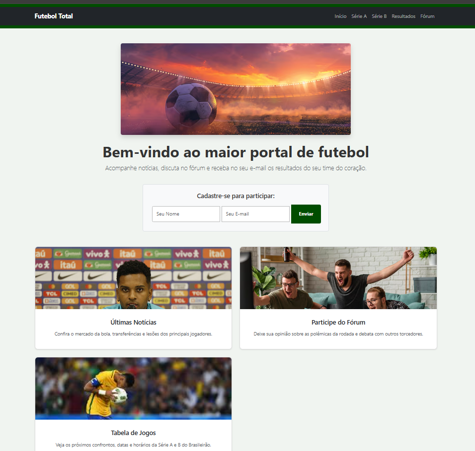
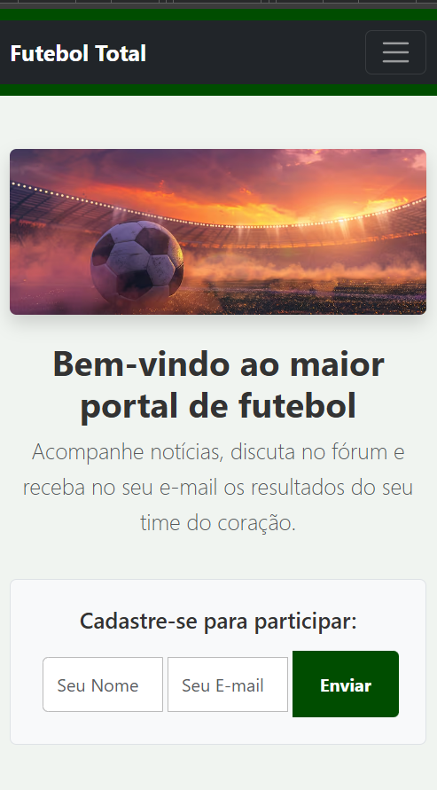
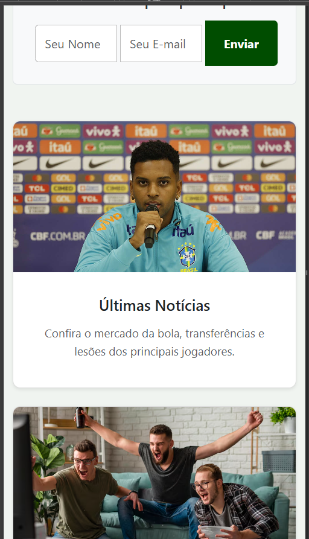
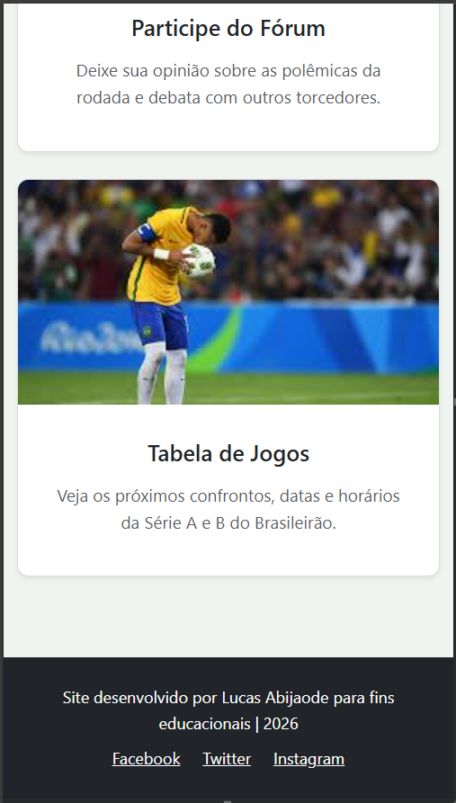

# ⚽ Futebol Total - Home Page Responsiva (v2.0)

Bem-vindo ao repositório do **Futebol Total**, uma landing page responsiva criada para ser o maior portal de futebol da internet! Este projeto evoluiu de uma estrutura em CSS puro para uma implementação moderna utilizando o framework **Bootstrap**.

## 📖 Sobre o Projeto
O **Futebol Total** simula a página inicial de um site esportivo onde os torcedores podem acompanhar as últimas notícias, conferir tabelas de jogos e interagir em um fórum. O foco desta versão (v2.0) foi a **refatoração para Bootstrap**, padronizando o layout e otimizando a responsividade para qualquer dispositivo.

## 👤 Dados do Aluno
* **Nome:** Lucas Abijaode
* **Matrícula:** 1569330
* **Curso:** Engenharia de Software - PUC Minas

## ✨ Funcionalidades e Evolução
- **Design Responsivo com Bootstrap:** Substituição de Media Queries manuais pelo sistema de Grid nativo do Bootstrap.
- **Layout Adaptável:** Configuração de 3 colunas para Desktop e ajuste automático para 1 coluna em dispositivos Mobile.
- **Componentes de Interface:** Implementação de `Navbar` colapsável e `Cards` estilizados com Shadow e Hover effects.
- **Tratamento de Imagens:** Uso de `img-fluid` e `object-fit: cover` para garantir que o banner e as fotos dos cards mantenham a proporção sem distorção.
- **Seção de Newsletter:** Formulário integrado ao grid, otimizado para captação de usuários.

## 🛠️ Tecnologias Utilizadas
- **HTML5:** Estruturação semântica.
- **CSS3:** Estilização personalizada e ajustes finos.
- **Bootstrap 5.3:** Framework principal para layout e responsividade.
- **Git & GitHub:** Controle de versão, commits incrementais e versionamento por tags.

## 📱 Capturas de Tela (Prints da v2.0)

### Versão Desktop
*Layout em 3 colunas com banner em largura total.*
 

### Versão Mobile
*Adaptação automática dos elementos empilhados para smartphones.*

## 🚀 Como executar o projeto
1. Clone este repositório.
2. Certifique-se de estar conectado à internet para carregar o Bootstrap via CDN.
3. Abra o arquivo `public/index.html` em qualquer navegador.

---
*Projeto desenvolvido para a disciplina de Desenvolvimento de Interfaces Web - PUC Minas.*